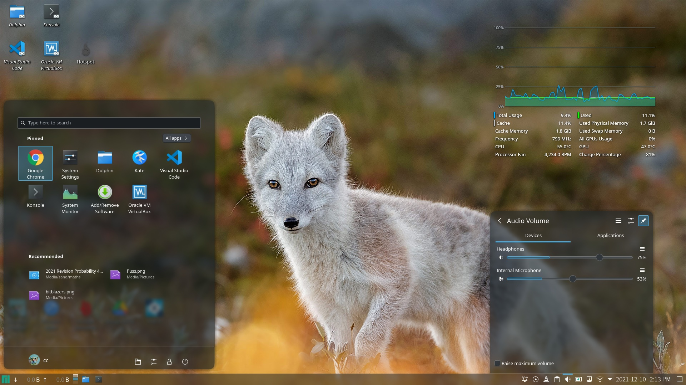
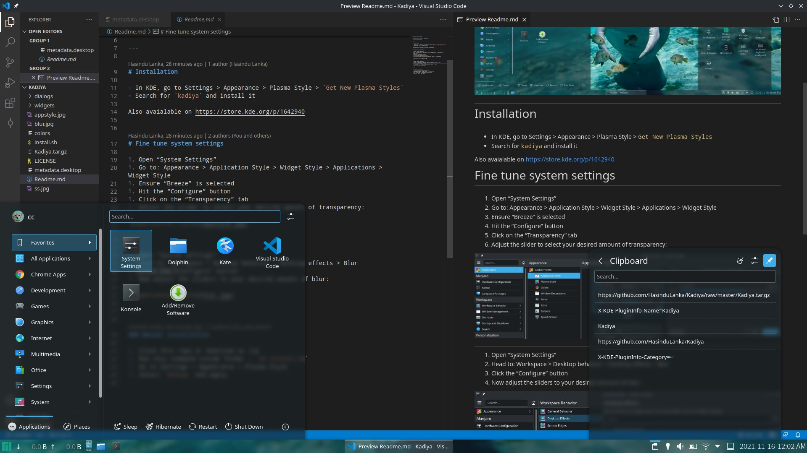
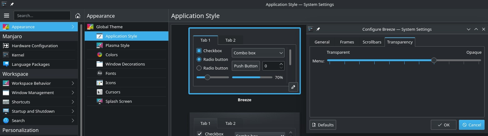
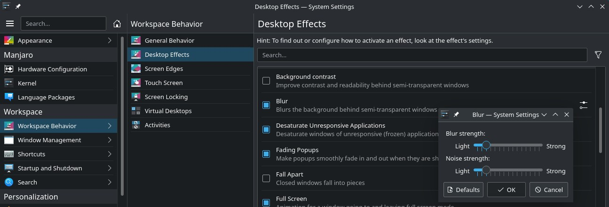

# Kadiya Plasma Theme

#### Minimal glassy theme for KDE plasma

Breeze Dark plasma style with transparent panels. Simple as possible.

---

# Installation

- In KDE, go to Settings > Appearance > Plasma Style > `Get New Plasma Styles`
- Search for `kadiya` and install it

Also avaialable on https://store.kde.org/p/1642940

# Fine tune system settings

1. Open “System Settings”
2. Go to: Appearance > Application Style
3. Ensure “Breeze” is selected
4. Hit the “Configure” button
5. Click on the “Transparency” tab
6. Adjust the slider to select your desired amount of transparency:

---

1. Open “System Settings”
2. Head to: Workspace > Desktop behavior > Desktop effects > Blur
3. Click the “Configure” button
4. Now adjust the sliders to your desired amount of blur:

---

### Manual installation

1. Clone this repo or download as zip
1. Run this command inside folder : `sh install.sh`
1. Go to Settings > Appearance > Plasma Style
1. Select `Kadiya` and apply
